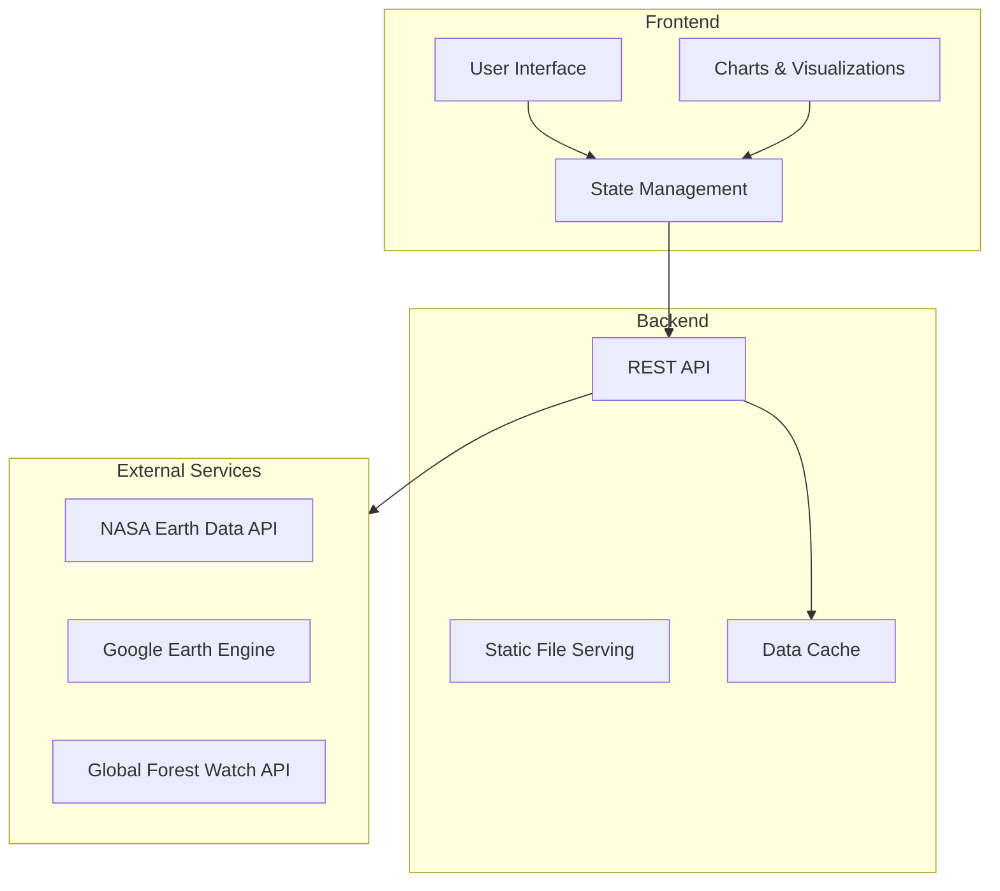

# Environmental Monitoring Dashboard 🌍

A real-time environmental monitoring system that visualizes satellite data to track urban development and environmental changes. This project combines data visualization and environmental metrics to provide insights into urban development patterns.


## System Architecture 



## 🌟 Features

- **Real-time Environmental Metrics**
  - Green space percentage tracking
  - Urban density monitoring
  - Air quality index
  - Forest cover analysis

- **Interactive Visualizations**
  - Time series analysis
  - Trend comparisons
  - Statistical overviews

- **Responsive Design**
  - Mobile-friendly interface
  - Adaptive charts
  - Real-time updates

## 🚀 Demo

View the live demo: [Environmental Monitor Demo](http://your-demo-link.com)

### Sample Visualizations

#### Environmental Metrics Over Time


#### Current Statistics


## 🛠️ Technology Stack

- **Frontend**
  - HTML5
  - CSS3 with Tailwind CSS
  - JavaScript
  - ECharts for visualizations

- **Backend**
  - Node.js
  - Express.js

- **External APIs**
  - NASA Earth Data API
  - Google Earth Engine
  - Global Forest Watch API

## ⚙️ Installation

1. **Clone the repository**
   ```bash
   git clone https://github.com/yourusername/environmental-monitor.git
   cd environmental-monitor
   ```

2. **Install dependencies**
   ```bash
   npm install
   ```

3. **Start the server**
   ```bash
   npm start
   ```

4. **Open in browser**
   ```
   http://localhost:3000
   ```

## 📁 Project Structure
```
environmental-monitor/
├── index.html          # Main HTML file
├── style.css          # Custom styles
├── app.js            # Frontend JavaScript
├── server.js         # Backend server
└── package.json      # Project dependencies
```

## 🔧 Configuration

Create a `.env` file in the root directory:

```env
PORT=3000
NASA_API_KEY=your_nasa_api_key
GEE_API_KEY=your_gee_api_key
GFW_API_KEY=your_gfw_api_key
```

## 📊 Sample Results

### Environmental Change Metrics (2018-2023)

| Year | Green Space | Urban Density | Air Quality | Forest Cover |
|------|------------|---------------|-------------|
